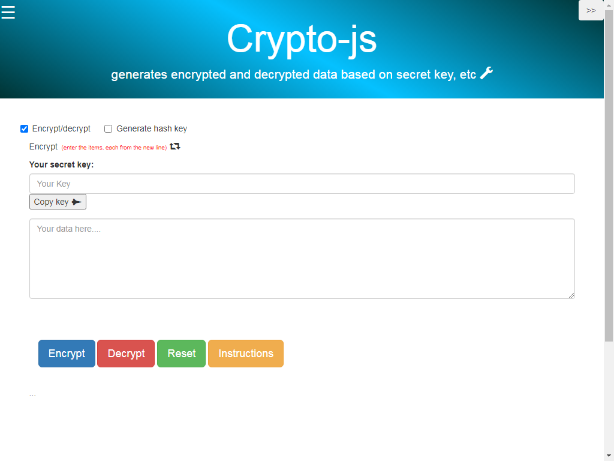
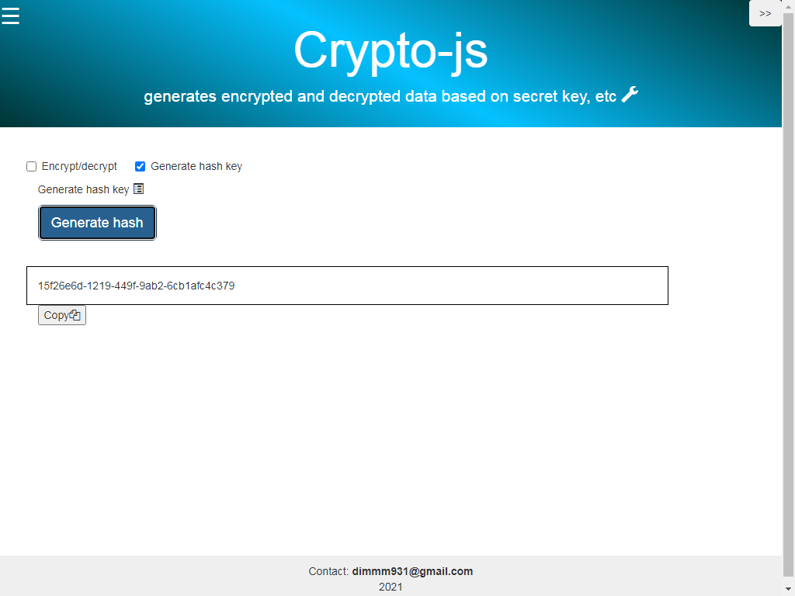
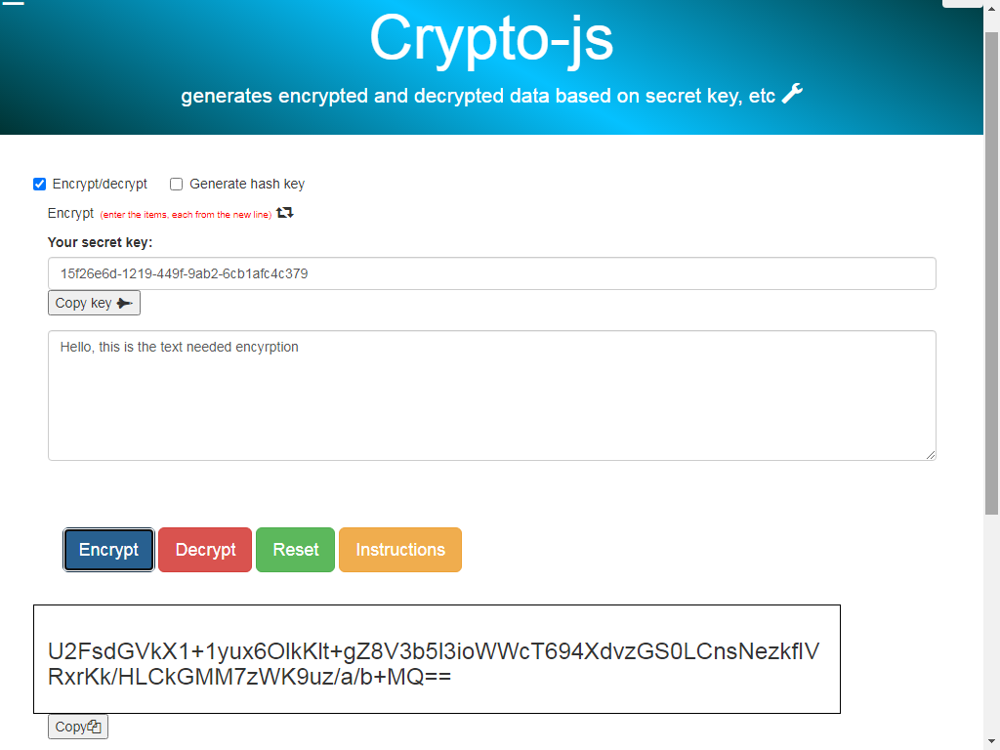
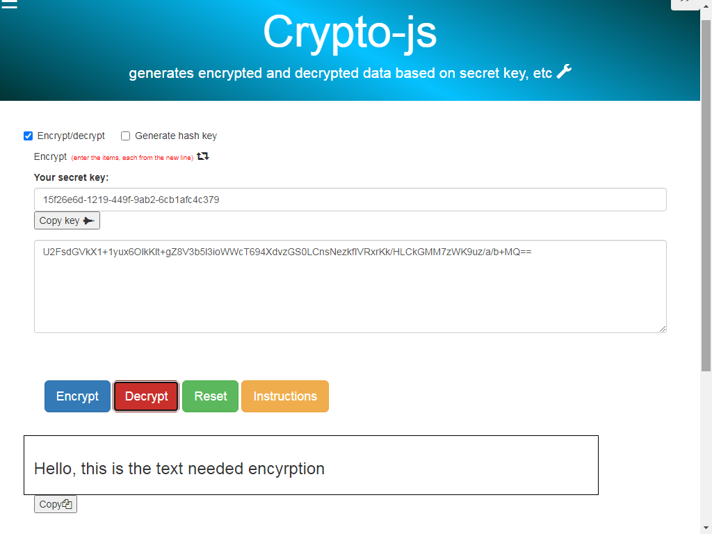
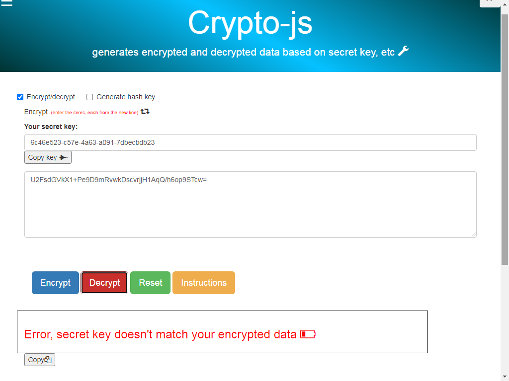

## CRYPTO JS Library

- 
Application to encrypt/decrypt your data using secret hash key.

- 
Works on Crypto Js library, written with CommonJS Modules, packed by Browserify + Gulp, Watchify, Npm.

- 
Source Js code is in folder <b>/js</b>, minified js file to include in html is in <b> /dist/js/bundle_js</b>.

- 
If you need to repack or edit the application, in order to be able to edit js files, copy the repository and run <b>npm install</b> to load all dependencies. 

- 
To pack with Browserify use command <b>gulp browserifyX</b> or <b> npm browserify js/my_crypto_main_js_file.js -o dist/js/bundle_js.js -d </b>

- 
To watch changes use <b> npm run watch-js </b>

- 
If encounter errors while repacking, install Browserify & Gulp globally: use  <b>npm uninstall browserify -g</b>, then <b>npm install browserify -g</b> and <b>npm install --global gulp-cli</b>

## Brief overview of application

### Section to auto-generate a secret hash key (if you don't have your own).

### On clicking "Encrypt" button, the app transforms your text "Hello, this is the text needed encryption" to an encrypted string. 

### On clicking "Decrypt" button and providing the secret hash key,  the app decrypts your encrypted string to text "Hello, this is the text needed encryption".

### If someone got your encrypted data and tries to decrypt it with invalid hash key, there will be no result 

### Watch the video.

[Watch the video on Youtube](https://youtu.be/P_-bDrTGCzA&vq=hd1080)

